# Yoclaw Architecture: Coroutine Analysis

## Overview

This document details all coroutines spawned using `tokio::spawn`, their main actors, owned resources, and inter-corsosnt communication patterns.

**Architecture Version:** 2.0 (Simplified - 2 coroutines, deadlock-safe)

---

## All `tokio::spawn` Locations

| #   | Location                                | Purpose                                      |
| --- | --------------------------------------- | -------------------------------------------- |
| 1   | `src/main.rs` (lines 35-72)             | **Unified Telegram** coroutine (poll + send) |
| 2   | `src/tasks/task_manager.rs` (line 100+) | **Agent Worker** coroutine (avoids deadlock) |

---

## 1. Unified Telegram Coroutine

**Location:** `src/main.rs` (lines 35-72)

### Main Actor

- **Telegram Handler** - A single coroutine that handles both polling incoming messages AND sending outgoing messages using `tokio::select!`

### Resources Owned

| Resource          | Type                     | Ownership                                |
| ----------------- | ------------------------ | ---------------------------------------- |
| `TelegramChannel` | `Arc<TelegramChannel>`   | **Shared** (channel_poll + channel_send) |
| `rx`              | `mpsc::Receiver<String>` | **Exclusive**                            |
| `chat_id`         | `&str` ("7235677031")    | **Exclusive** (hardcoded)                |
| `TaskManager`     | `Arc<TaskManager>`       | **Shared** (with Agent for tool calls)   |
| `shutdown_signal` | `Arc<Notify>`            | **Shared** (with TaskProcessor)          |

### Communication Patterns

| Direction    | Channel Type                                     | Purpose                                          |
| ------------ | ------------------------------------------------ | ------------------------------------------------ |
| **Incoming** | Telegram API (HTTP polling)                      | Polls `/getUpdates` every 1 second               |
| **Incoming** | `mpsc::Receiver<String>` (rx)                    | Receives AI response messages from TaskProcessor |
| **Outgoing** | Telegram API (via `channel_send.send_message()`) | Sends messages to hardcoded chat_id              |

### Loop Structure

```rust
loop {
    tokio::select! {
        // Branch 1: Send outgoing messages
        Some(msg) = rx.recv() => {
            channel_send.send_message(chat_id, &msg).await;
        }

        // Branch 2: Poll incoming messages
        _ = sleep(Duration::from_secs(1)) => {
            let messages = channel_poll.receive_messages().await;
            for msg in messages {
                task_manager.schedule_task(msg.text).await;
            }
        }
    }
}
```

**Lifecycle:** Runs indefinitely until the process is terminated

---

## 2. Agent Worker Coroutine

**Location:** `src/tasks/task_manager.rs` (lines 100-110)

### Main Actor

- **Agent Task Executor** - A worker that processes tasks from the `agent_rx` channel

### Resources Owned

| Resource          | Type                   | Ownership                                                            |
| ----------------- | ---------------------- | -------------------------------------------------------------------- |
| `Agent`           | `Agent` (owned)        | **Exclusive** - owns `messages: Vec<Message>` and `tools: Vec<Tool>` |
| `agent_rx`        | `mpsc::Receiver<Task>` | **Exclusive**                                                        |
| `channel_tx`      | `mpsc::Sender<String>` | **Exclusive** (sends to Telegram coroutine)                          |
| `TaskManager`     | `Arc<TaskManager>`     | **Shared** (with Telegram coroutine for scheduling)                  |
| `shutdown_signal` | `Arc<Notify>`          | **Shared** (with Telegram Coroutine)                                 |

**Note:** The Agent is **moved into** this coroutine, giving it exclusive ownership of:

- `messages: Vec<Message>` - conversation history (preserved across all tasks)
- `tools: Vec<Tool>` - available tool functions
- `api_url`, `api_key`, `model` - LLM configuration
- `client: Client` - HTTP client for API calls

### Communication Patterns

| Direction    | Channel Type                        | Purpose                                  |
| ------------ | ----------------------------------- | ---------------------------------------- |
| **Incoming** | `mpsc::Receiver<Task>` (agent_rx)   | Receives tasks from TaskProcessor        |
| **Outgoing** | `mpsc::Sender<String>` (channel_tx) | Sends AI responses to Telegram coroutine |
| **Internal** | `Agent::send_message()` → API calls | Makes HTTP requests to LLM API           |

### Loop Structure

```rust
while let Some(task) = agent_rx.recv().await {
    log::info!("Executing task {}", task.id);
    let response = agent.send_message(task.payload).await;
    channel_tx.send(response).await.expect("Failed to send to channel");
}
```

**Lifecycle:** Runs until the TaskProcessor exits (main loop breaks)

---

## Critical Design Decision: Why Agent Must Run in a Separate Coroutine

### The Deadlock Problem

If the Agent were on the **same thread** as TaskProcessor, a **deadlock** would occur when the Agent uses tools that call back to TaskManager:

```
1. TaskProcessor sends task → Agent starts executing (on same thread)
2. Agent uses schedule_task tool → sends to TaskManager → TaskProcessor channel
3. TaskProcessor is BLOCKED waiting for Agent to finish
4. Agent is BLOCKED waiting for TaskProcessor to schedule new task
5. DEADLOCK!
```

### The Solution

By running the Agent in a **separate coroutine** (`tokio::spawn`):

- TaskProcessor and Agent can proceed **concurrently**
- When Agent uses tools like `schedule_task`, `cancel_task`, or `list_tasks`, it can send messages to TaskProcessor without blocking itself
- TaskProcessor can process these messages while Agent continues executing

This is a critical design decision that ensures the system remains responsive and deadlock-free.

---

## Communication Architecture (Mermaid Diagram)

```mermaid
sequenceDiagram
    autonumber
    participant P1 as Main Thread (TaskProcessor)
    participant P2 as Agent Worker
    participant P3 as Unified Telegram Coroutine
    participant External as External Systems

    rect rgb(31, 90, 88)
        Note over P1, External: User task flow
        P3->>P1: Schedule immediate task (via TaskManager)
        P1->>P2: Dispatch task (via agent_tx)
        P2->>P2: Execute task (Agent.send_message)
        P2->>P3: Send response (via channel_tx)
        P3->>External: Forward to Telegram
    end

    rect rgb(41, 101, 50)
        Note over P1, External: Scheduled task flow
        P1->>P1: Deadline reached
        P1->>P2: Dispatch task (via agent_tx)
        P2->>P2: Execute task
        P2->>P3: Send response (via channel_tx)
        P3->>External: Forward to Telegram
    end

    rect rgb(90, 31, 31)
        Note over P1, External: Graceful shutdown flow
        External->>P3: SIGTERM (Ctrl+C)
        P3->>P1: Notify shutdown signal (Arc<Notify>)
        P1->>P1: Save pending tasks to tasks.json
        Note right of P1: Application exits cleanly
    end
```



---

## Communication Channels Summary

| Channel               | Type                | Size | Sender             | Receiver           | Purpose                        |
| --------------------- | ------------------- | ---- | ------------------ | ------------------ | ------------------------------ |
| **Outgoing Messages** | `mpsc::String`      | 16   | TaskProcessor      | Telegram Coroutine | Send AI responses to Telegram  |
| **Task Execution**    | `mpsc::Task`        | 32   | TaskProcessor      | Agent Worker       | Queue tasks for AI processing  |
| **Task Command**      | `mpsc::TaskCommand` | 100  | TaskManager (Arc)  | TaskProcessor      | Schedule/cancel/list tasks     |
| **Task Control**      | `oneshot::Result`   | 1    | TaskProcessor      | TaskManager        | Async response for cancel/list |
| **Shutdown Signal**   | `Arc<Notify>`       | N/A  | Telegram Coroutine | TaskProcessor      | Graceful shutdown coordination |

---

## Resource Ownership Matrix

| Resource                                | Owner                | Shared With                        | Access Pattern                                              |
| --------------------------------------- | -------------------- | ---------------------------------- | ----------------------------------------------------------- |
| **TelegramChannel**                     | Telegram Coroutine   | None (Arc clones within coroutine) | `Arc<TelegramChannel>` - concurrent read-only access        |
| **Agent (messages, tools)**             | Agent Worker (#2)    | None                               | Exclusive ownership - single owner prevents race conditions |
| **TaskManager**                         | TaskProcessor (main) | Telegram Coroutine, Agent Worker   | `Arc<TaskManager>` - concurrent access via channel          |
| **mpsc::Sender<String> (channel_tx)**   | Telegram Coroutine   | None                               | Exclusive ownership                                         |
| **mpsc::Receiver<String> (channel_rx)** | Telegram Coroutine   | None                               | Exclusive ownership                                         |
| **mpsc::Receiver<Task> (agent_rx)**     | Agent Worker (#2)    | None                               | Exclusive ownership                                         |
| **BinaryHeap<Task>**                    | TaskProcessor (main) | None                               | Exclusive ownership - task queue                            |
| **shutdown_signal (Arc<Notify>)**       | Telegram Coroutine   | TaskProcessor                      | `Arc<Notify>` - Telegram triggers, TaskProcessor listens    |

---

## Key Design Patterns Used

### 1. **Exclusive Ownership for Mutable State**

- **Agent** is owned exclusively by Agent Worker (#2), preventing concurrent access to `messages: Vec<Message>` and `tools: Vec<Tool>`
- This ensures conversation history integrity across all task executions

### 2. **Unified Coroutine via tokio::select!**

- Telegram polling and sending are merged into a **single coroutine**
- `tokio::select!` allows concurrent handling of both incoming and outgoing messages
- Eliminates the need for an intermediate `mpsc::String` channel between sender and poller

### 3. **Separate Agent Coroutine (Deadlock Prevention)**

- Agent runs in a **separate coroutine** from TaskProcessor
- When Agent uses tools (schedule_task, cancel_task, list_tasks), it can call back to TaskManager without causing deadlock
- This is a critical design decision for system correctness

### 4. **Priority Queue with BinaryHeap**

- TaskProcessor uses `BinaryHeap<Task>` to prioritize tasks by deadline
- Tie-breaking by task ID ensures deterministic ordering

### 5. **Oneshot for Request-Response**

- Used for synchronous operations where the caller needs an immediate response:
  - `TaskManager::cancel_task()` → returns `Result<(), CancelError>` via oneshot
  - `TaskManager::list_tasks()` → returns `Vec<Task>` via oneshot

---

## Critical Observations

1. **No Race Conditions on Agent State**: The Agent is **exclusively owned** by Agent Worker (#2), ensuring `messages: Vec<Message>` is never accessed concurrently.

2. **Deadlock-Free Design**: The separate Agent coroutine prevents deadlocks when tools call back to TaskManager. This is a critical design decision.

3. **Simplified Telegram Handling**: Merging polling and sending into one coroutine reduces complexity and eliminates one hop in the message chain.

4. **Task Ordering**: Tasks are processed by deadline priority using `BinaryHeap`, ensuring time-sensitive tasks are handled first.

5. **Buffer Sizes**:
   - Outgoing messages: 16 (small, for immediate responses)
   - Task execution: 32 (medium, for backpressure)
   - Task commands: 100 (larger, for management operations)

6. **Error Handling**:
   - Telegram coroutine logs errors but continues polling
   - Agent Worker panics on channel errors (expected behavior - indicates system shutdown)

---

## Graceful Shutdown

### Shutdown Signal Flow

The application implements graceful shutdown using `Arc<Notify>` to coordinate between coroutines:

```
1. User sends SIGTERM (Ctrl+C) → tokio::signal::ctrl_c() triggers in Telegram Coroutine
2. Telegram Coroutine calls shutdown_signal_clone.notify_waiters()
3. TaskProcessor receives shutdown signal via shutdown_signal.notified()
4. TaskProcessor saves pending tasks to tasks.json
5. Application exits cleanly
```

### Implementation Details

**In `src/main.rs`:**

- Creates `shutdown_signal = Arc::new(Notify::new())`
- Telegram coroutine listens for `tokio::signal::ctrl_c()` (lines 67-72)
- On signal: logs message and calls `shutdown_signal_clone.notify_waiters()`
- Passes `shutdown_signal.clone()` to `task_processor.run()`

**In `src/tasks/task_manager.rs`:**

- `TaskProcessor::run()` receives `shutdown_signal: Arc<Notify>` parameter
- Uses `shutdown_signal.notified()` in `tokio::select!` (lines 187-194)
- On shutdown: saves pending tasks to `tasks.json` before exiting

### Shutdown Triggers

| Trigger          | Source             | Handler                      | Action               |
| ---------------- | ------------------ | ---------------------------- | -------------------- |
| SIGTERM / Ctrl+C | Telegram Coroutine | `tokio::signal::ctrl_c()`    | Notify TaskProcessor |
| Channel closed   | TaskProcessor      | `tokio::select!` else branch | Save tasks and exit  |

---

## Architecture Evolution

### Version 1.0 (Original - 3 Coroutines)

```
Telegram Poller → TaskManager → TaskProcessor → Agent Worker → Telegram Sender → Telegram API
```

**Issues:**

- 3-hop response path (Agent Worker → Telegram Sender → Telegram API)
- Unnecessary `mpsc::String` channel between TaskProcessor and Telegram Sender
- Agent Worker coroutine added complexity without benefit

### Version 2.0 (Simplified - 2 Coroutines, Deadlock-Safe)

```
Telegram Coroutine (poll + send) ←→ TaskProcessor → Agent Worker → Telegram Coroutine
```

**Benefits:**

- Direct communication: TaskProcessor → Telegram coroutine (via Agent Worker)
- Agent stays in separate coroutine (avoids deadlock when using tools)
- One fewer coroutine to manage (Telegram sender + poller merged)
- Simpler mental model
- **Crucially: No deadlocks when Agent uses tools**
