# Yoclaw Architecture: Coroutine Analysis

## Overview

This document details all coroutines spawned using `tokio::spawn`, their main actors, owned resources, and inter-coroutine communication patterns.

**Architecture Version:** 2.2 (Agent in Main Thread - split channel send/receive coroutines)

---

## All `tokio::spawn` Locations

| #   | Location      | Purpose                                            |
| --- | ------------- | -------------------------------------------------- |
| 1   | `src/main.rs` | **Graceful Shutdown** coroutine (SIGTERM listener) |
| 2   | `src/main.rs` | **Telegram Listener** coroutine (poll incoming)    |
| 3   | `src/main.rs` | **Telegram Sender** coroutine (send outgoing)      |
| 4   | `src/main.rs` | **TaskProcessor** coroutine (avoids deadlock)      |

---

## 1. Telegram Listener Coroutine

**Location:** `src/main.rs`

### Main Actor

- **Telegram Listener** - A coroutine that polls for incoming Telegram messages and schedules tasks

### Resources Owned

| Resource          | Type                       | Ownership                              |
| ----------------- | -------------------------- | -------------------------------------- |
| `TelegramChannel` | `Arc<dyn Channel>`         | **Shared** (listener + sender)         |
| `TaskRouter`      | `Arc<TaskRouter>`          | **Shared** (listener + sender + tasks) |
| `TaskManager`     | `Arc<TaskManager>`         | **Shared** (with Agent for tool calls) |
| `shutdown_signal` | `watch::Receiver<bool>`    | **Shared**                             |

### Communication Patterns

| Direction    | Channel Type                | Purpose                           |
| ------------ | --------------------------- | --------------------------------- |
| **Incoming** | Telegram API (HTTP polling) | Polls `/getUpdates` via long poll |
| **Outgoing** | `TaskManager`               | Schedules user messages through the shared routing-aware scheduler |

### Loop Structure

```rust
loop {
    tokio::select! {
        _ = tokio::time::sleep(Duration::from_secs(1)) => {
            match self.channel.receive_messages().await {
                Ok(messages) => {
                    for msg in messages {
                        task_manager
                            .schedule_task(
                                msg.text,
                                None,
                                None,
                                TaskRouteBinding::ChatId(msg.chat_id.clone()),
                            )
                            .await;
                    }
                }
            }
        }

        _ = shutdown_signal.changed() => {
            break;
        }
    }
}
```

**Lifecycle:** Runs indefinitely until the process is terminated

---

## 2. Telegram Sender Coroutine

**Location:** `src/main.rs`

### Main Actor

- **Telegram Sender** - A coroutine that drains `channel_rx`, resolves `task_id -> chat_id` through `TaskRouter`, and forwards responses without being blocked by long polling

### Resources Owned

| Resource          | Type                              | Ownership                      |
| ----------------- | --------------------------------- | ------------------------------ |
| `TelegramChannel` | `Arc<dyn Channel>`                | **Shared** (listener + sender) |
| `TaskRouter`      | `Arc<TaskRouter>`                 | **Shared** (listener + sender + tasks) |
| `channel_rx`      | `mpsc::Receiver<ChannelResponse>` | **Exclusive**                  |

### Loop Structure

```rust
loop {
    match channel_rx.recv().await {
        Some(response) => self.forward_response(response).await,
        None => break,
    }
}

self.task_router.save().await;
```

**Lifecycle:** Runs until all `channel_tx` senders are dropped, then saves routes and exits

---

## 3. TaskProcessor Coroutine

**Location:** `src/main.rs` (lines 72-75)

### Main Actor

- **Task Queue Manager** - Manages the task queue, deadline scheduling, and persistence

### Resources Owned

| Resource          | Type                          | Ownership                                                    |
| ----------------- | ----------------------------- | ------------------------------------------------------------ |
| `TaskProcessor`   | `TaskProcessor` (owned)       | **Exclusive** - owns `BinaryHeap<Task>` and `mpsc::Receiver` |
| `task_rx`         | `mpsc::Receiver<TaskCommand>` | **Exclusive** (receives schedule/cancel/list commands)       |
| `pending_tasks`   | `BinaryHeap<Task>`            | **Exclusive** (priority queue ordered by deadline)           |
| `TaskRouter`      | `Arc<TaskRouter>`             | **Shared** (used for recurring-task route inheritance)       |
| `shutdown_signal` | `watch::Receiver<bool>`       | **Shared** (listens for shutdown from main)                  |

**Note:** The TaskProcessor runs in a **separate coroutine** to allow the Agent (in main thread) to use tools like `schedule_task` without deadlock.

### Communication Patterns

| Direction    | Channel Type                    | Purpose                                  |
| ------------ | ------------------------------- | ---------------------------------------- |
| **Incoming** | `mpsc::Receiver<TaskCommand>`   | Receives schedule/cancel/list commands   |
| **Outgoing** | `mpsc::Sender<Task>` (agent_tx) | Sends ready tasks to Agent (main thread) |
| **Internal** | `BinaryHeap` operations         | Manages task queue by deadline priority  |

### Loop Structure

```rust
loop {
    tokio::select! {
        // Branch 1: Task command arrives
        Some(msg) = self.task_rx.recv() => {
            match msg {
                TaskCommand::Schedule(task) => self.pending_tasks.push(task),
                TaskCommand::Cancel(task_id, reply_tx) => { /* remove task */ },
                TaskCommand::ListTasks(reply_tx) => { /* return tasks */ },
            }
        }

        // Branch 2: Timer fires (deadline reached)
        _ = sleep(sleep_duration) => {
            while let Some(task) = self.pending_tasks.peek() {
                if task.is_ready() {
                    let task = self.pending_tasks.pop().unwrap();
                    if let Some(next_task) = task.next_recurrence() {
                        self.task_router.copy(&task.id, next_task.id).await;
                        self.pending_tasks.push(next_task);
                    }
                    agent_tx.send(task).await;
                }
            }
        }

        // Branch 3: Shutdown signal
        _ = shutdown_signal.changed() => {
            self.save_tasks().await;
            break;
        }
    }
}
```

**Lifecycle:** Runs until shutdown signal received or channel closed

---

## Critical Design Decision: Why TaskProcessor Must Run in a Separate Coroutine

### The Deadlock Problem

If the TaskProcessor were on the **same thread** as the Agent (main thread), a **deadlock** would occur when the Agent uses tools that call back to TaskManager:

```
1. TaskProcessor sends task → Agent starts executing (on main thread)
2. Agent uses schedule_task tool → sends to TaskManager → TaskProcessor channel
3. TaskProcessor is BLOCKED waiting for Agent to finish
4. Agent is BLOCKED waiting for TaskProcessor to schedule new task
5. DEADLOCK!
```

### The Solution

By running the **TaskProcessor in a separate coroutine** (`tokio::spawn`):

- Agent (main thread) and TaskProcessor can proceed **concurrently**
- When Agent uses tools like `schedule_task`, `cancel_task`, or `list_tasks`, it can send messages to TaskProcessor without blocking
- TaskProcessor can process these messages while Agent continues executing

This allows the Agent to stay in the main thread (keeping `!Send` state local) while avoiding deadlocks.

---

## Communication Architecture (Mermaid Diagram)

```mermaid
sequenceDiagram
    autonumber
    participant P1 as Main Thread (Agent)
    participant P2 as TaskProcessor
    participant P3 as Channel Handler
    participant P4 as Channel Sender
    participant P5 as Shutdown Thread
    participant External as External Systems

    rect rgb(31, 90, 88)
        Note over P1, External: User task flow
        External->>P3: User message
        P3->>P2: Schedule task with `ChatId` binding (via TaskManager)
        P2->>P1: Dispatch task (via agent_tx)
        P1->>P1: Execute task (Agent.send_message)
        P1->>P4: Send response (via channel_tx)
        P4->>External: Forward to Telegram
    end

    rect rgb(41, 101, 50)
        Note over P1, External: Scheduled task flow
        P1->>P2: `schedule_task` tool call with `Inherit(task_id)`
        P2->>P2: Deadline reached
        P2->>P1: Dispatch task (via agent_tx)
        P1->>P1: Execute task
        P1->>P4: Send response (via channel_tx)
        P4->>External: Forward to Telegram
    end

    rect rgb(90, 31, 31)
        Note over P1, External: Graceful Shutdown Flow
        External->>P5: SIGTERM (Ctrl+C)
        P5->>P2: watch::Sender<bool>
        P5->>P3: watch::Sender<bool>
        P2->>P2: Save pending tasks to tasks.json
        P3->>P3: Stop polling for new messages
        P2->>P1: `agent_tx` dies
        P1->>P4: `channel_tx` dies
        P4->>P4: Drain pending responses until channel closes
        P4->>P4: Save routing table to routes.json
        Note over P1, External: Application exits cleanly
    end
```



---

## Communication Channels Summary

| Channel               | Type                    | Size | Sender             | Receiver                | Purpose                        |
| --------------------- | ----------------------- | ---- | ------------------ | ----------------------- | ------------------------------ |
| **Outgoing Messages** | `mpsc::ChannelResponse` | 16   | Agent (main)       | Telegram Sender         | Send AI responses to Telegram  |
| **Task Execution**    | `mpsc::Task`            | 32   | TaskProcessor      | Agent (main)            | Queue tasks for AI processing  |
| **Task Command**      | `mpsc::TaskCommand`     | 100  | TaskManager (Arc)  | TaskProcessor           | Unified schedule/cancel/list path |
| **Task Control**      | `oneshot::Result`       | 1    | TaskProcessor      | TaskManager             | Async response for cancel/list |
| **Shutdown Signal**   | `watch::bool`           | 1    | Shutdown Coroutine | TaskProcessor, Listener | Graceful shutdown coordination |

---

## Resource Ownership Matrix

| Resource                                         | Owner               | Shared With               | Access Pattern                                              |
| ------------------------------------------------ | ------------------- | ------------------------- | ----------------------------------------------------------- |
| **TelegramChannel**                              | Channel Handler     | Listener, Sender          | `Arc<dyn Channel>` - concurrent read-only access            |
| **Agent (messages, tools)**                      | Main Thread (Agent) | None                      | Exclusive ownership - single owner prevents race conditions |
| **TaskManager**                                  | Main (Arc)          | Telegram Coroutine, Agent | `Arc<TaskManager>` - single scheduling entrypoint           |
| **mpsc::Sender<ChannelResponse> (channel_tx)**   | Main Thread (Agent) | None                      | Exclusive ownership                                         |
| **mpsc::Receiver<ChannelResponse> (channel_rx)** | Telegram Sender     | None                      | Exclusive ownership                                         |
| **mpsc::Receiver<Task> (agent_rx)**              | Main Thread (Agent) | None                      | Exclusive ownership                                         |
| **BinaryHeap<Task>**                             | TaskProcessor       | None                      | Exclusive ownership - task queue                            |
| **TaskRouter**                                   | Task Subsystem      | Listener, Sender, TaskProcessor, TaskManager | `Arc<TaskRouter>` for route lookup, persistence, and copy |
| **shutdown_signal (watch::Receiver<bool>)**      | Shutdown Coroutine  | TaskProcessor, Listener   | `watch` broadcast, cloned per coroutine                     |

---

## Key Design Patterns Used

### 1. **Exclusive Ownership for Mutable State**

- **Agent** is owned by the main thread, preventing concurrent access to `messages: Vec<Message>` and `tools: Vec<Tool>`
- This ensures conversation history integrity across all task executions

### 2. **Split Channel I/O**

- Telegram polling and Telegram sending run in **separate coroutines**
- Long polling on `getUpdates` no longer blocks outgoing replies
- Shared routing state is centralized in `TaskRouter`

### 3. **TaskProcessor in Separate Coroutine (Deadlock Prevention)**

- TaskProcessor runs in a **separate coroutine** from the Agent (main thread)
- When Agent uses tools (schedule_task, cancel_task, list_tasks), it can call back to TaskManager without causing deadlock
- This is a critical design decision for system correctness

### 4. **Priority Queue with BinaryHeap**

- TaskProcessor uses `BinaryHeap<Task>` to prioritize tasks by deadline
- Tie-breaking by task ID ensures deterministic ordering

### 5. **Oneshot for Request-Response**

- Used for synchronous operations where the caller needs an immediate response:
  - `TaskManager::cancel_task()` → returns `Result<(), CancelError>` via oneshot
  - `TaskManager::list_tasks()` → returns `Vec<Task>` via oneshot

---

## Critical Observations

1. **No Race Conditions on Agent State**: The Agent is **owned by the main thread**, ensuring `messages: Vec<Message>` is never accessed concurrently.

2. **Deadlock-Free Design**: The separate TaskProcessor coroutine prevents deadlocks when Agent tools call back to TaskManager. This is a critical design decision.

3. **Route-Aware Scheduling**: `TaskManager::schedule_task(...)` is the single scheduling entrypoint. It resolves route bindings through `TaskRouter` before enqueueing work, so delayed and repeating tasks remain deliverable.

4. **Task Ordering**: Tasks are processed by deadline priority using `BinaryHeap`, ensuring time-sensitive tasks are handled first.

5. **Buffer Sizes**:
   - Outgoing messages: 16 (small, for immediate responses)
   - Task execution: 32 (medium, for backpressure)
   - Task commands: 100 (larger, for management operations)

6. **Error Handling**:
   - Telegram coroutine logs errors but continues polling
   - Agent panics on channel errors (expected behavior - indicates system shutdown)

---

## Graceful Shutdown

### Shutdown Signal Flow

The application implements graceful shutdown using `watch::bool` to coordinate between coroutines:

```
1. User sends SIGTERM (Ctrl+C) → tokio::signal::ctrl_c() triggers in Shutdown Coroutine
2. Shutdown Coroutine broadcasts `true` through `watch::Sender<bool>`
3. TaskProcessor receives shutdown signal via `shutdown_signal.changed()`
4. Channel Handler listener receives shutdown signal via `shutdown_signal.changed()`
5. TaskProcessor saves pending tasks to tasks.json
6. Channel Sender drains remaining responses and `TaskRouter` saves routes.json
7. Application loops exit, process stops cleanly
```

### Implementation Details

**In `src/main.rs`:**

- Creates `let (shutdown_tx, shutdown_rx) = watch::channel(false)`
- Spawns a dedicated coroutine to listen for `tokio::signal::ctrl_c()` (lines 51-58)
- On signal: logs message and sends `true` through `shutdown_tx`
- Passes cloned `shutdown_rx` to both `task_processor.run()` and `channel_handler.start_listening()`

**In `TaskProcessor::run()` and `ChannelHandler::start_listening()`:**

- Both loop mechanisms use `shutdown_signal.changed()` inside `tokio::select!`
- On shutdown trigger: state is persisted as JSON to the configuration directory before exiting the loop

### Shutdown Triggers

| Trigger          | Source             | Handler                      | Action              |
| ---------------- | ------------------ | ---------------------------- | ------------------- |
| SIGTERM / Ctrl+C | Shutdown Coroutine | `tokio::signal::ctrl_c()`    | Broadcast `watch`   |
| Channel closed   | Respective Loop    | `tokio::select!` else branch | Save state and exit |

---

## Architecture Evolution

### Version 1.0 (Original - 3 Coroutines)

```
Telegram Poller → TaskManager → TaskProcessor → Agent Worker → Telegram Sender → Telegram API
```

**Issues:**

- 3-hop response path (Agent Worker → Telegram Sender → Telegram API)
- Unnecessary `mpsc::String` channel between TaskProcessor and Telegram Sender
- Agent Worker coroutine added complexity without benefit

### Version 2.0 (Simplified - Agent in Worker Coroutine)

```
Telegram Coroutine (poll + send) ←→ TaskProcessor → Agent Worker → Telegram Coroutine
```

**Issues:**

- Agent in separate coroutine, TaskProcessor in main thread
- Deadlock risk when Agent uses tools that call back to TaskManager

### Version 2.1 (Agent in Main Thread - Deadlock-Safe)

```
Telegram Coroutine (poll + send) ←→ Agent (main) ←→ TaskProcessor (spawned)
```

**Benefits:**

- Agent in main thread keeps `!Send` state local
- TaskProcessor in separate coroutine allows concurrent tool calls
- Direct communication: Agent → Telegram coroutine (via channel_tx)
- Simpler mental model
- **Crucially: No deadlocks when Agent uses tools**
